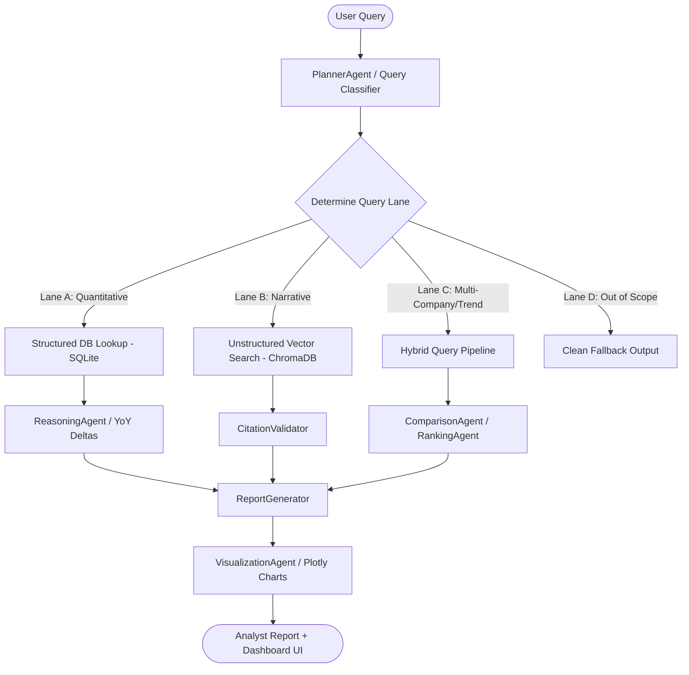

# Sustally ESG Intelligence Platform - Architecture

This document describes the high-level system architecture and data pipelines of the **Sustally ESG Intelligence Platform**.

---

## 1. Architectural Overview

Sustally is an AI-powered ESG (Environmental, Social, and Governance) intelligence dashboard designed to ingest, process, and analyze Business Responsibility and Sustainability Reports (BRSR) of public and private companies.

The system is designed for **sub-second latency** on quantitative questions and high precision on narrative questions, leveraging a **dual-retrieval agentic architecture**:

---

## 2. Multi-Lane Query Routing

To prevent the high latency and hallucination risks of generic RAG systems, Sustally routes incoming user queries into four distinct execution lanes:

| Lane | Query Intent | Technology / Retrieval Path | Example Query |
| :--- | :--- | :--- | :--- |
| **Lane A** | Quantitative / Fact-Based | SQLite (`metrics.db`) deterministic SQL queries. | *"What is the water consumption of Infosys in 2024?"* |
| **Lane B** | Narrative / Qualitative | ChromaDB vector store pre-filtered by company and year. | *"What is the climate risk mitigation strategy of TCS?"* |
| **Lane C** | Analytical / Trend / Comparative | Combined SQLite query + multi-company metrics aggregator. | *"Compare Scope 1 emissions between TCS and Infosys in 2024."* |
| **Lane D** | Out of Scope | Graceful deflection handler (doesn't trigger LLM). | *"What is the stock price of Apple?"* |

---

## 3. The Multi-Agent Intelligence Pipeline

Sustally coordinates processing using specialized agent modules located under `src/agents/`:

- **PlannerAgent (`planner_agent.py`)**: Acts as the central orchestrator. It parses the query, identifies target companies, years, metrics, and routes the query to the correct lane.
- **RetrievalAgent (`retrieval_agent.py`)**: Fetches matching data. Operates structured queries on `MetricsStore` and semantic searches on `ChromaStore`.
- **RankingAgent (`ranking_agent.py`)**: Computes sector-wide leaderboards and sorting operations.
- **ComparisonAgent (`comparison_agent.py`)**: Integrates multi-company metrics and contrasts achievements, highlighting outliers.
- **ReasoningAgent (`reasoning_agent.py`)**: Runs mathematical and analytical operations, such as computing Year-Over-Year (YoY) percentage changes, direction of change, and unit conversions.
- **CitationValidator (`citation_validator.py`)**: Ensures factual grounding. It cross-references LLM outputs against source PDF/XML tags and coordinates the confidence scoring.
- **ReportGenerator (`report_generator.py`)**: Assembles the findings into a standard analyst report layout incorporating Executive Summary, Factual Evidence, YoY Trends, and Citations.
- **VisualizationAgent (`visualization_agent.py`)**: Translates structured data tables into interactive Plotly figures displayed directly on the Streamlit dashboard.

---

## 4. Ingestion & Preprocessing

The ingestion pipeline handles raw sustainability reports (`.pdf`, `.xml`):

1. **Parser Layer (`xml_loader.py` & `pdf_loader.py`)**: Extracts structured tables, text blocks, and metadata tags from reports.
2. **Normalizer (`normalizer.py` & `metric_taxonomy.py`)**: Standardizes company names, fiscal years, metric keys (e.g. converting different labels for emissions to a standard `scope1_emissions`), values, and units (e.g., kL to Liters).
3. **Structured Database (`metrics_store.py`)**: populates standardized numerical metrics into a queryable SQLite database.
4. **Vector Database (`chroma_store.py`)**: Computes sentence embeddings using `sentence-transformers/all-MiniLM-L6-v2` and indexes chunked text for qualitative retrieval.
