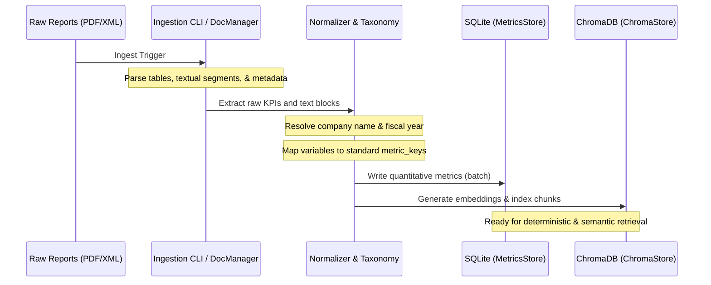
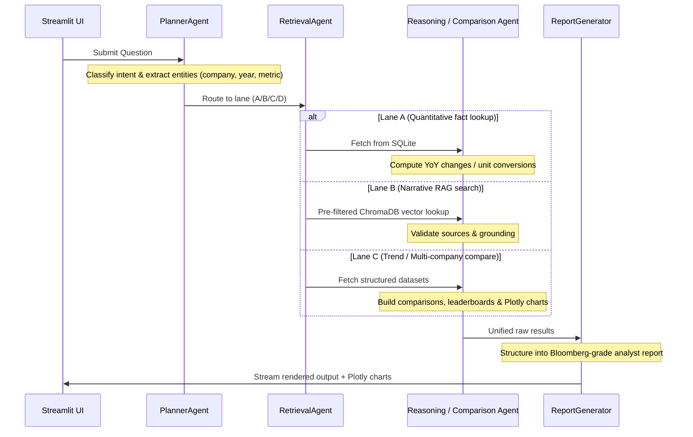

# Platform Workflows and Lifecycles

This document describes the step-by-step lifecycles of **Ingestion** and **Query Processing** inside Sustally.

---

## 1. Ingestion Lifecycle

The ingestion workflow processes raw corporate sustainability reports (PDFs, XMLs) into standardized database schemas and vector index structures.

### Steps:
1. **Link Extraction (`link_extractor.py`)**: (Optional) Scans master disclosure sheets for report links and downloads XML/PDF targets.
2. **Bulk/Incremental Loader (`bulk_xml_importer.py` & `document_manager.py`)**:
   - Reads documents from `data/incoming_xml/` and `data/raw_reports/`.
   - Parses the XML tag structures or PDF characters.
   - If parsing fails, moves records to `_unsorted/` to prevent contamination.
3. **Normalization Layer (`metric_taxonomy.py` & `normalizer.py`)**:
   - Resolves target company and year.
   - Maps raw metric descriptions to the unified taxonomy keys (e.g. `water_consumption_kl`, `scope1_emissions`, `female_employee_wage_share_pct`).
   - Normalizes numerical values and converts units.
4. **Storage Layer (`metrics_store.py` & `chroma_store.py`)**:
   - Saves metrics to the SQLite relational database.
   - Generates text embeddings via SentenceTransformers and index chunks into the Chroma collection.

---

## 2. Query Execution Lifecycle

When a user submits a question through the Streamlit dashboard, the system coordinates multiple agents to process the query dynamically:

### Steps:
1. **Intention Mapping (`planner_agent.py`)**:
   - Identifies the query lane.
   - Extracts company entities, years, and specific ESG indicators.
2. **Information Fetching (`retrieval_agent.py`)**:
   - For quantitative questions: Runs a direct SQL query against the `metrics` table.
   - For qualitative questions: Performs a semantic search in ChromaDB. Search is pre-filtered by `company` and `year` metadata, ensuring no cross-contamination between different reports.
3. **Data Synthesis & Computation (`reasoning_agent.py` & `comparison_agent.py`)**:
   - Calculates percentage deltas, checks increase/decrease patterns, and applies conversions.
   - Organizes sector comparisons and generates chart details.
4. **Analyst Report Compiling (`report_generator.py` & `citation_validator.py`)**:
   - Constructs markdown paragraphs containing sections: *Executive Summary*, *Evidence & Key Findings*, *YoY Trends*, *Grounding Confidence*, and *Citations*.
   - Attaches debugging logs, showing which DB tables or files were searched.
5. **UI Rendering (`streamlit_app.py`)**:
   - Streams text characters live.
   - Renders interactive charts (via `src/visualization/charts.py`).
